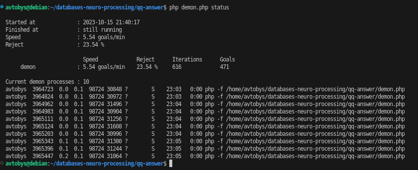

Usage: `php -f demon.php [stop|start|restart|status|help|log]`
```
Available arguments:
  start    - starts the daemon and its processes
  restart  - restarts the daemon and its processes
  stop     - kills all processes of the daemon at once
  status   - shows the status of the daemon and its processes
  help     - displays help on how to use the script
  log      - displays the logs of the daemon and its processes
```

Example status:


